# Motor：在分离式内存上为分布式事务启用多版本机制

**Ming Zhang, Yu Hua\*, Zhijun Yang**
Wuhan National Laboratory for Optoelectronics, School of Computer, Huazhong University of Science and Technology
\*Corresponding Author: Yu Hua (csyhua@hust.edu.cn)

原文：OSDI 2024, 第801–819页

---

## 摘要

在现代数据中心中，内存分离技术将单体服务器解耦，构建出通过网络互连的独立计算池和内存池，从而提升资源利用率并提供高性能服务。计算池通过分布式事务访问内存池中的远程数据，以保证原子性和强一致性。现有的单版本设计由于并发度有限、日志开销高而受到制约。虽然传统单体服务器中的多版本设计有望提供高并发并降低日志开销，但其无法直接应用于分离式内存。为了弥合多版本设计与分离式内存之间的鸿沟，我们提出了 Motor——通过整体性地重新设计版本结构和事务协议，在分离式内存上实现快速分布式事务处理的多版本机制。为了在内存池中高效组织同一数据的不同版本，Motor 采用一种新颖的**连续版本元组（CVT）**结构，将各版本连续存储于连续地址空间中，使计算池只需一次网络往返即可获取目标版本。在 CVT 之上，Motor 设计了一套完全基于单侧 RDMA 的 MVCC 协议，支持具有灵活隔离级别的快速分布式事务。实验结果表明，与现有最优系统相比，Motor 将吞吐量最高提升 98.1%，将延迟最高降低 55.8%。

**Abstract**

In modern datacenters, memory disaggregation unpacks monolithic servers to build network-connected distributed compute and memory pools to improve resource utilization and deliver high performance. The compute pool leverages distributed transactions to access remote data in the memory pool to provide atomicity and strong consistency. Existing single-versioning designs have been constrained due to limited system concurrency and high logging overheads. Although the multi-versioning design in the conventional monolithic servers is promising to offer high concurrency and reduce logging overheads, which however fails to work in the disaggregated memory. In order to bridge the gap between the multi-versioning design and the disaggregated memory, we propose Motor that holistically redesigns the version structure and transaction protocol to enable multi-versioning for fast distributed transaction processing on the disaggregated memory. To efficiently organize different versions of data in the memory pool, Motor leverages a new consecutive version tuple (CVT) structure to store the versions together in a continuous manner, which allows the compute pool to obtain the target version in a single network round trip. On top of CVT, Motor leverages a fully one-sided RDMA-based MVCC protocol to support fast distributed transactions with flexible isolation levels. Experimental results demonstrate that Motor improves the throughput by up to 98.1% and reduces the latency by up to 55.8% compared with state-of-the-art systems.

---

## 1. 引言

内存分离技术在现代数据中心中受到广泛关注。具体而言，内存分离将传统单体服务器中的计算资源和内存资源解耦，构建独立且可弹性扩展的计算池与内存池，两者通过高速网络（如 RDMA 或 CXL）相互连接。计算池包含大量高性能计算单元用于执行任务，以及少量基于 DRAM 的内存用于维护元数据。内存池则由大量内存模块组成，用于存储应用数据，并配备少量计算单元，仅负责内存分配和网络互连。借助高效的资源池化，内存分离技术显著提升了资源利用率、弹性和故障隔离能力。

为在分离式内存上为应用程序提供原子性和强一致性保证，计算池需借助分布式事务来访问内存池中的远程数据。近期，FORD 系统已能够在分离式内存上运行分布式事务。为简化内存池中的数据存储，FORD 对每条数据仅维护一个版本。然而，这种**单版本设计**存在并发度限制——在事务提交期间，正在写入的数据对读操作不可见，读操作必须等待写操作完成。此外，为保证原子性，FORD 需要写入大量 undo 日志来备份旧数据，这消耗了网络带宽并降低了吞吐量。

启用多版本机制有望高效解决上述限制。通过在内存池中存储每条数据的多个版本，读请求可以获取数据的现有版本，而无需等待写操作完成，从而提升并发度。此外，借助多版本机制，旧版本数据天然充当"undo 日志"来保证原子性，从而消除 undo 日志的写入开销。此前已有研究在传统单体架构中提出了基于多版本的分布式事务处理系统，但这些系统难以在新型分离式内存架构上工作，原因有二：

**1）事务协议不兼容。** 运行于单体架构的既有系统假设每台服务器都拥有强大的 CPU 来执行事务协议中的计算任务（如加锁、验证、时间戳计算等）。然而，内存池中的 CPU 计算能力太弱，无法频繁处理大量计算任务。

**2）版本结构效率低下。** 现有方案使用基于指针的链式结构（本文称为"链式链接"）来动态链接各版本。常见的有两种：旧到新链（从最旧版本到最新版本）和新到旧链（从最新版本到最旧版本）。读取特定版本时，CPU 需要执行"链式遍历"，沿指针逐个拉取版本直至目标版本。在单体服务器中，链式遍历可在本地内存上快速执行；但在分离式内存中，所有应用数据都存储在远程内存池，而内存池中没有足够强大的 CPU 执行链式遍历。因此，计算池不得不通过多次网络往返，逐个拉取远程版本，直至找到目标版本，导致高开销。实验表明，将链式遍历步数从 1 增加到 20，RDMA 读取延迟增加了 24.8 倍。此外，需要垃圾回收（GC）来删除不再被任何事务使用的过期版本，而在分离式内存上，GC 难以高效执行。

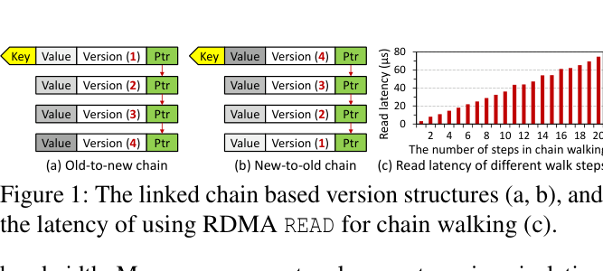

**图1：** 基于链式链接的版本结构（a 旧到新链、b 新到旧链）及 RDMA READ 链式遍历步数与读取延迟的关系（c）。术语说明：Old-to-new chain（旧到新链）、New-to-old chain（新到旧链）、chain walking（链式遍历）、Read latency（读取延迟）、number of steps（遍历步数）

为解决上述挑战，我们提出了 **Motor**，通过整体性地重新设计版本结构和事务协议，在分离式内存上实现多版本分布式事务处理。Motor 放弃链式链接，引入新颖的**连续版本元组（CVT）**结构，将同一数据的多个版本连续存储于连续地址空间中。计算池只需一次 RDMA READ 便可获取某条数据的所有版本，而无需逐个拉取远程版本，从而降低网络开销、实现低延迟。当 CVT 填满时，Motor 采用轻量级的**协调者主动垃圾回收（GC）**方案，以抢占式方式回收旧版本，无需追踪事务状态。在 GC 执行期间，Motor 还能让应用程序轻松验证 CVT 中数据值与其版本的一致性，保证正确性。

在 CVT 结构之上，Motor 设计了一套快速 MVCC 事务协议，完全利用单侧 RDMA 绕过内存池中的弱计算单元。该协议允许读操作不被写操作阻塞，并避免写日志，从而提升并发度、节省网络带宽。此外，该协议支持多种隔离级别（如可串行化和快照隔离），以灵活满足不同 OLTP 应用的需求。

本文的主要贡献如下：

- 提出 Motor，在分离式内存上为分布式事务实现多版本机制。
- Motor 设计了新颖的 CVT 结构，高效组织内存池中数据的多个版本。CVT 使计算池能够在一次往返中获取目标版本，并提供无需状态追踪的轻量级垃圾回收。
- Motor 设计了一套快速 MVCC 事务协议，充分利用单侧 RDMA 和 CVT，在无强 CPU 内存池的约束下支持多种隔离级别。
- 实验结果表明，Motor 相比现有最优系统将事务吞吐量最高提升 98.1%，将延迟最高降低 55.8%。

---

## 2. 背景与动机

### 2.1 内存分离

传统数据中心由大量单体服务器组成，每台服务器包含一组计算和内存单元。这种单体架构存在资源利用率低、故障域粗糙的缺陷——即使用户只需要更多算力，也必须增加整台服务器，其中的内存模块被浪费；一旦某个 CPU 故障，整台服务器都将不可用。

内存分离是一种有前景的解决方案，它将单体服务器中的计算和内存资源解耦，构建独立的资源池，通过 RDMA 或 CXL 等高速网络互连。计算池包含强大的 CPU 用于密集执行计算任务，以及少量 DRAM 用于缓存部分元数据；内存池由大量内存模块组成，存储大规模应用数据，不具备强计算能力，仅配备少量低功耗计算单元用于内存分配和网络互连。通过高效的资源池化，数据中心可以按需为不同应用提供适量的计算和内存资源，从而提高资源利用率、降低成本，并缩小故障域。

本文假设计算池使用单侧 RDMA 操作（包括 READ、WRITE 以及 CAS、FAA 等原子操作）访问内存池中的应用数据，绕过远程 CPU，与现有研究保持一致。

### 2.2 分离式内存上的事务处理

**系统模型。** 为在分离式内存上为应用程序提供原子性和强一致性保证，计算池需要通过分布式事务来访问内存池中的远程数据。具体而言，计算池中的 CPU 线程运行大量**协调者（Coordinator）**，执行事务协议以读取数据、处理冲突并提交更新。计算池不存储应用数据，但维护少量 DRAM 用于缓存元数据（如远程数据地址）。内存池存储所有应用数据，不执行计算任务。每条数据被复制到多个副本以实现高可用性。为容忍故障，Motor 采用 $(f+1)$ 路主备复制，为内存池中每条数据生成 1 个主副本和 $f$ 个备副本。

**单版本的局限性。** FORD 是现有支持分离式内存上分布式事务的代表系统，它在内存池中只存储每条数据的最新版本。这种单版本设计简化了内存存储，但带来两个局限：（1）**并发度低**——事务提交期间，正在更新的数据不可读，直到写操作完成才对外可见，阻塞了读操作；（2）**日志开销高**——FORD 需要向所有副本写入 undo 日志以保证原子性，这消耗了网络带宽，协调者还需等待所有日志请求的 ACK 之后才能提交更新。

### 2.3 启用多版本机制

为解决单版本的局限，Motor 采用多版本方法，在内存池中为每条数据存储多个版本。这样，写操作不会阻塞读操作——读请求直接获取数据的现有版本，无需等待更新操作完成，从而提升并发度。此外，多版本设计无需额外写入日志来备份副本中的数据，因为旧版本天然充当"undo 日志"保证原子性，从而消除日志开销、加速事务提交。

**挑战。** 现有多版本研究均面向传统单体架构设计，不适用于分离式内存，原因如前所述：（1）其事务协议依赖内存中的强 CPU 执行大量计算任务；（2）新到旧和旧到新链式结构在分离式内存上的链式遍历代价高昂，垃圾回收开销大。Motor 针对这两个挑战，提出了全新的设计。

---

## 3. Motor 总体架构

Motor 系统由两部分协同工作：**Motor 内存存储**（第4节）负责在内存池中高效组织多版本数据；**Motor 事务协议**（第5节）负责在计算池中处理基于多版本的分布式事务。

**工作流程：**

1. 客户端利用内存池中的 CPU 分配内存，将应用数据加载到关系型数据库（DB）表中，这些表由 CVT 结构组织，可通过哈希表或 B+ 树索引快速访问。
2. 在计算池与内存池之间建立 RDMA 连接，内存池将部分元数据（如 RDMA 内存区域地址和索引描述信息）发送给计算池，帮助协调者在运行时定位远程数据。
3. 客户端向计算池发出事务请求。
4. 计算池通过 CPU 线程并发运行大量协调者，利用 Motor 事务协议处理事务：协调者获取并锁定远程数据，执行事务逻辑，验证数据版本未被更改，最后将更新提交到远程内存池并解锁。整个过程完全通过单侧 RDMA 实现，绕过内存池中的弱计算单元。

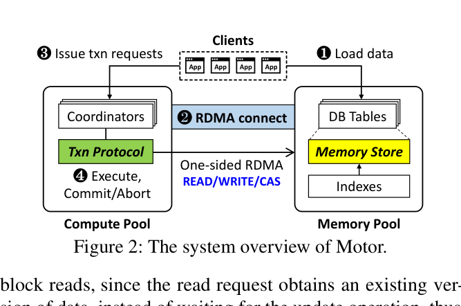

**图2：** Motor 系统总体架构。术语说明：Coordinators（协调者）、DB Tables（数据库表）、Memory Pool（内存池）、Compute Pool（计算池）、READ/WRITE/CAS（单侧 RDMA 操作类型）

---

## 4. Motor 内存存储

### 4.1 连续版本元组（CVT）

**核心思想。** Motor 提出**连续版本元组（CVT）**结构，在内存池中维护数据的不同版本。与使用指针链接版本的链式链接不同，CVT 将各版本连续存储于连续地址空间中。利用 CVT，协调者只需一次 RDMA READ 即可获取多个版本，而无需通过链式遍历逐个读取远程版本直至目标版本。获取 CVT 后，协调者在本地搜索目标版本，由于不涉及任何网络 I/O，速度极快。

**结构设计。** CVT 由一个**头部（Header）**和若干**版本单元（Vcell）**组成。Header 包含：TableID（所属数据库表）、Key（记录的唯一标识符）、Lock（用于并发控制）、AttrBarPtr（指向值域中的属性条带）、VpkgPtr（指向值域中的值包）。每个 Vcell 包含：VcellSA/VcellEA（起始/结束锚标志，用于一致性检测）、Valid（当前版本是否有效）、Version（版本号）、Bitmap（记录本版本修改的属性位图）、StartOffset（属性在属性条带中的偏移量）。

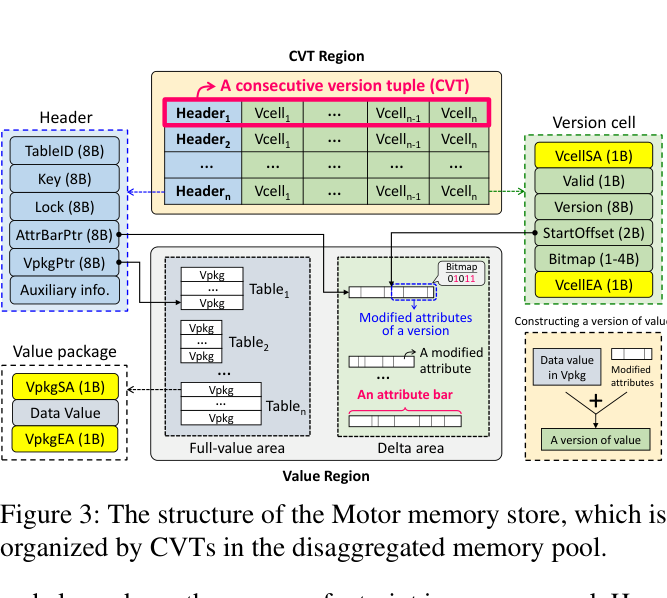

**图3：** Motor 内存存储的结构，即分离式内存池中以 CVT 组织的内存布局。术语说明：CVT Region（CVT 区域）、Value Region（值域）、Header（头部）、Version cell / Vcell（版本单元）、Full-value area（全值区）、Delta area（delta 区/增量区）、Attribute bar（属性条带）、Vpkg（值包）、TableID（表标识）、Key（键）、Lock（锁）、AttrBarPtr（属性条带指针）、VpkgPtr（值包指针）、VcellSA/VcellEA（版本单元起始/结束锚）、VpkgSA/VpkgEA（值包起始/结束锚）、Valid（有效位）、Version（版本号）、Bitmap（属性位图）、StartOffset（起始偏移量）

**CVT 中的版本数量（VNum）。** Motor 将 VNum 配置为固定值，因为内存池缺乏足够的 CPU 动态调整。VNum 的选择涉及读取延迟、内存占用和事务中止率之间的权衡：VNum 过小时 CVT 小、延迟低、内存占用少，但 GC 频繁触发，高争用时中止率上升；VNum 过大时中止率低，但内存浪费且 RDMA 读取延迟增加。实验（第7.2节）表明，对于低争用短事务工作负载（如 TATP），VNum=2 已足够；对于高争用长事务工作负载（如 TPCC），VNum=4 可高效降低中止率而不引入过高内存开销。

**索引支持。** Motor 通过统一接口支持哈希表和 B+ 树索引，使协调者能够快速访问远程 CVT。CVT 直接存储在索引结构中，写入 CVT 时同步修改索引。

**CVT 地址缓存。** 为避免每次读取 CVT 时都需要拉取完整的哈希桶，Motor 为每个协调者在计算池中维护一个小型私有 CVT 地址缓存，存储 CVT 的远程地址。下次读取相同 CVT 时，可直接用缓存地址访问，无需读取哈希桶。若缓存地址失效，协调者重新读取哈希桶并更新缓存。

### 4.2 独立值域

Motor 将 CVT 与数据值在内存池中分开存储：协调者先读取 CVT 确定目标版本，再读取对应的值。这样，CVT 大小不受值大小影响，保持稳定的低读取延迟，且每次只传输一个数据值，节省网络带宽。

**降低内存开销。** 为避免为每个版本存储完整值导致的内存浪费，Motor 利用两点观察：（1）关系型数据库表中的记录遵循固定 schema；（2）事务更新记录时通常只修改部分属性。因此，Motor 存储**可变大小的被修改属性**（而非完整值）来维护不同版本，从而降低内存开销。

值域分为**全值区**（存储最新版本的完整值）和 **delta 区**（存储事务修改的旧属性，类似"undo 日志"）。要构造某条记录的旧版本值，只需将该版本对应的旧属性覆盖到最新的完整值上即可。

**属性条带（Attribute Bar）。** 在 delta 区中，Motor 利用**属性条带**结构连续紧凑地存储某条记录跨事务的被修改属性。CVT 头部的 AttrBarPtr 指向该属性条带；Vcell 中的 Bitmap 记录当前版本修改了哪些属性；StartOffset 记录当前版本的属性在属性条带中的偏移量。

**属性条带大小。** Motor 通过采样事务执行来估计每条记录在一次事务中被修改属性的总大小（TotAttrSize）分布，并据此估算属性条带大小（ABS）：

$$\text{ABS} = \sum_{i=1}^{n} \max\!\left(VNum \times Frequency_i,\ 1\right) \times TotAttrSize_i$$

其中 $n$ 为不同 TotAttrSize 取值的个数，$Frequency_i$ 为第 $i$ 种修改大小在事务中出现的频率。原文公式截图如下：

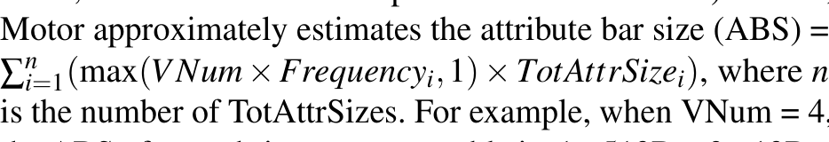

**缓解属性条带分配争用。** Motor 预先为每个协调者分配专属的小块 delta 空间，协调者在自己的 delta 空间中分配属性条带，无需与其他协调者竞争。

**一次 RTT 读写值。** 尽管完整值与属性分开存储，Motor 只需一次往返时间（RTT）便可完成读写。读取时，若目标版本是最新版本，直接用一次 RDMA READ 读取完整值；否则，利用 AttrBarPtr、StartOffset 和 Bitmap 计算所需旧属性的远程地址，然后用批量 RDMA READ 在一次 RTT 内同时读取完整值和旧属性，在本地构造目标版本的值。写入时，协调者用批量 RDMA WRITE 在一次 RTT 内同时更新完整值并将旧属性追加到属性条带中。

### 4.3 协调者主动垃圾回收

若更新数据时 CVT 中没有空闲 Vcell，则需要垃圾回收（GC）机制来回收过期版本。传统 GC 方案需要追踪最旧的运行中事务，但在分离式内存中，内存池中的计算单元无法感知事务状态，追踪开销高昂。

为避免追踪开销，Motor 提出**协调者主动 GC 方案**：当没有空闲 Vcell 时，协调者主动选择一个"受害版本"，将其覆盖为新版本，从而完成 GC，无需追踪最旧的运行中事务。

具体地，Motor 让协调者**抢占式地选择 CVT 中最旧的版本**作为受害版本。由于 RDMA 能显著加速事务，最旧版本被使用的概率极低。这种方案避免了基线方法（使用读取队列跳过正在被读的版本）带来的额外 RTT 开销。代价是少数长事务可能因读取的数据被快速回收而中止，但实验表明，在 CVT 中保留合适数量的版本可以高效缓解这类中止。覆盖旧版本会使 CVT 中的版本无序，但不影响正确性，因为协调者会在本地遍历所有版本来定位目标版本。

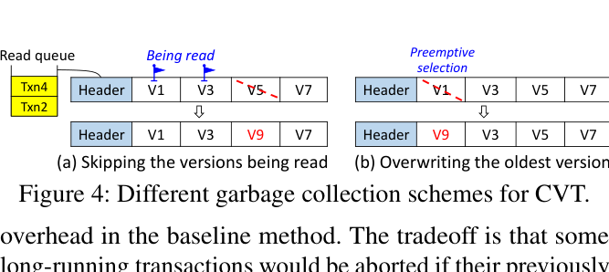

**图4：** CVT 的两种垃圾回收方案对比。术语说明：(a) Skipping the versions being read（跳过正在被读的版本，基线方案）、(b) Overwriting the oldest version（覆盖最旧版本，Motor 方案）、Being read（正在被读）、Preemptive selection（抢占式选择）、Read queue（读取队列）

### 4.4 锚标志辅助读取

由于版本和数据值分开存储，当一个协调者 C1 正在读取 CVT 并尝试获取目标版本的值时，另一个协调者 C2 可能正在执行 GC 并覆盖该版本。这会导致 C1 读到被 C2 部分更新的损坏值，或错误地将 C2 写入的新值视为旧版本的值。

为解决这一挑战，Motor 提出**锚标志辅助读取方案**，利用四个锚标志（VcellSA、VcellEA、VpkgSA、VpkgEA，每个 1 字节）帮助协调者以"原子"方式读取版本和对应的值：

- **写入规则：** 协调者将四个锚标志同时加1使其相等，写入顺序为：先写 Vpkg，再写修改的属性，最后写 Vcell。
- **读取规则：** 协调者读取 CVT 后，获取 Vpkg 和必要属性，然后检查最新 VcellSA 和 VcellEA 是否等于 VpkgSA 和 VpkgEA。若四个锚标志相等，说明值和属性自上次读取以来未被修改，可以安全地重构目标版本的值；否则，事务因检测到部分更新或冲突的 GC 而中止。

**保证写入顺序。** 锚标志辅助读取的正确性依赖于写入数据以正确顺序安装到内存池中。Motor 禁用内存池中的 DDIO（数据直接 I/O），确保写入以先进先出的顺序直接写入主存，满足所需的写入顺序要求。

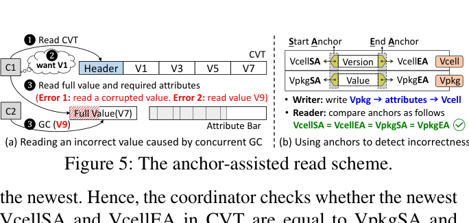

**图5：** 锚标志辅助读取方案。术语说明：(a) Reading an incorrect value caused by concurrent GC（并发 GC 导致读取错误值）、(b) Using anchors to detect incorrectness（利用锚标志检测不一致）、Full Value（完整值）、Attribute Bar（属性条带）、Vpkg（值包）、VcellSA/VcellEA（版本单元起始/结束锚）、VpkgSA/VpkgEA（值包起始/结束锚）、Start Anchor / End Anchor（起始锚 / 结束锚）、Writer（写者）、Reader（读者）

---

## 5. Motor 事务协议

Motor 事务协议在广泛认可的事务处理框架下工作（读取数据、处理冲突、写回数据），完全利用 CVT 结构和纯单侧 RDMA，在分离式内存上支持基于 MVCC 的分布式事务。

**时间戳生成。** Motor 使用顺序数字作为事务时间戳（1, 2, 3, ...），同时也作为数据版本号。时间戳生成与 Motor 的其余设计正交，可采用现有的可扩展时间戳生成方案。

**概述。** 内存池中，每张表被复制为 1 个主副本和 $f$ 个备副本，弱计算单元不参与事务处理。计算池中，协调者通过 Motor 协议执行事务，并通过单侧 RDMA 访问远程数据。

### 5.1 事务处理阶段

以一个具有可串行化保证的读写事务 T0 为例（读写集为 {A, B}，只读集为 {C}）。在 Motor 中，写集包含在读集中，因为对于更新和删除操作，协调者需要先读取远程 CVT 再写回；对于插入操作，需要先读取哈希桶获取空闲 CVT。

**阶段1：执行（Execution）。**

协调者从时间戳服务获取开始时间戳 $T_{start}$。对于只读（RO）或读写（RW）数据，协调者先查找本地 CVT 地址缓存：

- **地址已缓存：** 对于 RO 数据，用 RDMA READ 从主副本读取其 CVT；对于 RW 数据，用 doorbell 批量 RDMA CAS+READ 分别对主副本加锁并读取 CVT。若加锁失败，协调者立即中止事务（而非等待），以避免死锁。
- **地址未缓存：** 协调者用 RDMA READ 读取哈希桶，在本地搜索匹配的 CVT。

获取 CVT 后，协调者选择**目标版本 V0**，即所有小于 $T_{start}$ 的版本中最大的那个。

**提前中止（Early Abort）：** 若 CVT 中存在大于 $T_{start}$ 的版本，说明另一事务 T1 已在 T0 的 $T_{start}$ 之后提交。协调者可提前中止 T0 以保证可串行化，因为即使继续执行，T0 最终也会在验证阶段失败。

选定目标版本后，协调者用批量 RDMA READ 读取 Vpkg 和必要旧属性，构造目标版本的值。随后执行三项正确性检查：（1）若任何加锁失败，中止 T0；（2）若重新读取的 CVT 中出现比 V0 更新的版本，中止 T0；（3）若四个锚标志不等，中止 T0。通过所有检查后，协调者安全地使用 Vpkg 中的数据值执行事务逻辑。

**阶段2：验证（Validation）。**

所有 RW 数据的远程 CVT 成功加锁后，协调者从时间戳服务获取提交时间戳 $T_{commit}$。若事务仅包含 RW 数据（无 RO 数据），可跳过后续操作。否则，协调者需要验证从 $T_{start}$ 到 $T_{commit}$ 期间 RO 数据的版本未发生变化，以保证可串行化。协调者重新读取每条 RO 数据的 CVT，检查是否出现以下两种情况：（1）CVT 被另一协调者加锁；（2）新选出的版本 $V' \neq V0$。若任一情况发生，验证失败，事务中止。

**阶段3：提交（Commit）。**

验证成功后，协调者在一次 RTT 内将更新批量写入所有远程副本并解锁主副本。具体地：

- **更新（Update）：** 协调者在其预分配的 delta 空间中分配属性条带（若为首次更新），找到 CVT 中空闲的 Vcell，填写 Valid、Version（设为 $T_{commit}$）、Bitmap、StartOffset，并设置四个锚标志相等。若无空闲 Vcell 或属性条带空间不足，主动执行 GC。随后准备新的 Vpkg，填入新的数据值，设置 VpkgSA 和 VpkgEA 等于 VcellSA。
- **插入（Insert）：** 除准备 Vpkg 和 Vcell 外，还需准备新的 Header，填写 TableID、Key、VpkgPtr。新插入的数据可以与属性条带共享 delta 区空间，提升空间效率。
- **删除（Delete）：** 将 V0 的 Valid 置为 0，使后续时间戳更大的事务无法使用已删除的版本，并将远程内存池中的完整值更新为旧版本值。

所有本地准备完成后，协调者用 doorbell 批量 RDMA WRITE 将准备好的数据写入所有副本，并在一次 RTT 内解锁主副本。收到所有副本的 ACK 后，向应用程序报告"已提交"。

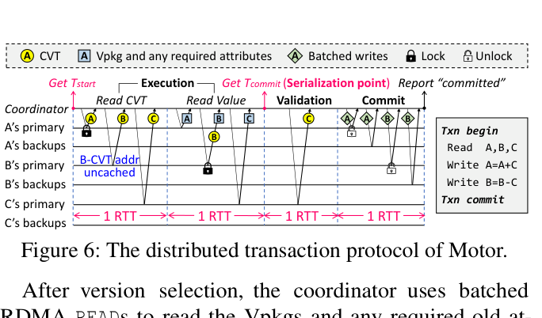

**图6：** Motor 的分布式事务协议流程图（以读写事务为例）。术语说明：Execution（执行阶段）、Validation（验证阶段）、Commit（提交阶段）、1 RTT（一次网络往返）、Lock（加锁）、Unlock（解锁）、Primary（主副本）、Backup（备副本）、Write A=A+C / Write B=B-C（更新操作示例）

**只读事务处理。** 协调者获取读时间戳 $T_{start}$，从主副本读取所需 CVT，用 $T_{start}$ 确定目标版本，再读取 Vpkg 和必要旧属性构造目标版本的值。检查四个锚标志是否相等，相等则提交，否则中止。注意：在多版本设计中，只读事务**无需验证**，因为 $T_{start}$ 时刻的版本快照是稳定的。

### 5.2 灵活支持隔离级别

Motor 支持两种广泛使用的隔离级别：**可串行化（SR）**和**快照隔离（SI）**。

- **支持 SR：** 对于读写事务，通过加锁保证 RW 数据版本在 $T_{start}$ 到 $T_{commit}$ 期间不变，通过验证保证 RO 数据版本不变。对于只读事务，多版本设计允许将其"移动"到合适的串行化执行点，满足可串行化要求。
- **支持 SI：** 禁用读写事务中 RO 数据的版本验证，允许事务使用 $T_{start}$ 时刻的旧快照。仍需加锁解决写写冲突。SI 弱于 SR，但性能更高（第7.7节），已被 MySQL、PostgreSQL、Oracle、SQL Server 等系统采用。

**ACID 保证：** Motor 保证完整的 ACID 特性：多版本天然提供原子性，副本复制保证持久性，锁和验证机制保证隔离性。

### 5.3 容错机制

**内存池副本故障。** Motor 通过 RDMA 快速检测副本故障。若任何副本在提交前故障，协调者丢弃已获取数据、解锁并中止事务。若主副本在提交期间故障，Motor 将某个备副本提升为新主副本，保留已提交的更新。若备副本故障，协调者选择另一内存节点添加新备副本，必要时进行数据迁移。

**计算池协调者故障。** Motor 使用租约机制检测协调者故障。协调者将小尺寸操作日志写入本地内存（最大 556B/事务），记录执行期间的关键操作（如待加锁或提交的 key）。协调者故障后，Motor 生成新协调者，利用操作日志恢复飞行中的提交并解锁相关 key，避免饥饿。

**网络故障。** 网络分区难以与服务器故障区分。Motor 参照 uKharon 的方式，假设网络分区由数据中心管理员发现并解决。分区发生时，为满足 OLTP 对一致性的严格要求，Motor 仅允许主分区提供服务，牺牲部分可用性。

---

## 6. 实现细节

**事务接口。** Motor 提供以下接口，供应用程序轻松运行分布式 MVCC 事务：

- `TxnBegin()`：开始事务并记录其 ID。
- `GetTS()`：从时间戳服务获取时间戳。
- `AddObject()`：将只读或读写对象加入相应集合。
- `FetchAll()`：获取远程 CVT 及目标版本的数据值，同时加锁 CVT。
- `Validate()`：验证只读数据的版本。
- `TxnCommit()`：将更新写回远程副本并解锁主副本，完成事务提交。

**执行框架。** 计算池通过 CPU 核心生成大量线程并行执行事务。为避免 CPU 核心在等待 RDMA ACK 时空转浪费算力，Motor 在每个线程中生成多个**协程（Coroutine）**以流水线方式执行：一个协程轮询 RDMA ACK，其余协程各自作为事务协调者。这样，大量协调者可以在计算池中并发执行事务，充分利用 CPU 算力。

---

## 7. 性能评估

### 7.1 实验配置

**实验平台。** 4 台服务器通过 Mellanox SB7890 100Gbps InfiniBand 交换机互连，每台服务器配备 100Gbps Mellanox ConnectX-5 IB RNIC。其中一台服务器（配备 Intel Xeon Gold 6330 CPU）作为计算池运行协调者，另外三台服务器组成内存池，每台配备 192GB DRAM。

**基准测试程序。** 使用**键值存储（KVS）**作为微基准（10M 键值对，键 8B，值 40B，Zipfian 分布访问），以及三种广泛使用的 OLTP 基准：

- **TATP**（电信应用）：4 张 DB 表，80% 只读事务，2M 用户，记录最大 48B。
- **SmallBank**（银行应用）：2 张 DB 表，85% 读写事务，10M 账户，记录 16B。
- **TPCC**（复杂订单系统）：9 张 DB 表，92% 读写事务，24 个仓库，记录最大 672B。

所有基准测试采用 3 路副本（1 主 2 备）。

**对比系统。** Motor 与两个最优系统对比：（1）**FaRMv2-DM**：将 FaRMv2（支持单体架构多版本事务）用单侧 RDMA 重新实现以兼容分离式内存；（2）**FORD**：支持分离式内存上单版本事务的系统。

### 7.2 CVT 版本数量

随着 VNum 增加，事务吞吐量通常先上升后下降：增加 VNum 降低了只读事务的中止率（如 TPCC 中 STOCK_LEVEL 的中止率从 VNum=2 时的 32.1% 降至 VNum=4 时的 3.8%），但继续增加 VNum 后，CVT 变大导致 RDMA 读取延迟增加，增加的读取开销超过了降低中止率带来的收益。不同工作负载的最优 VNum 差异显著：TPCC 取 4，SmallBank 取 3，TATP 取 2，KVS 取 4。

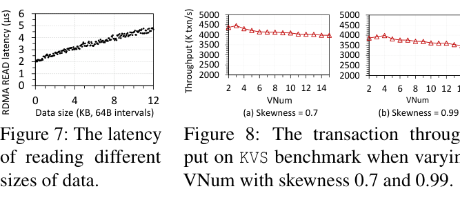

**图7：** 不同数据大小下的 RDMA READ 延迟。**图8：** KVS 基准测试中不同倾斜度（skewness）下吞吐量随 VNum 变化的曲线。术语说明：Data size（数据大小）、RDMA READ latency（RDMA 读取延迟）、Throughput（吞吐量）、Skewness（访问倾斜度）、VNum（CVT 中版本数量）

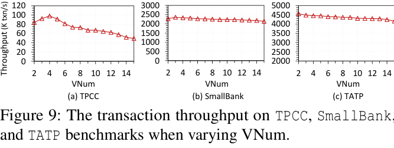

**图9：** TPCC、SmallBank 和 TATP 基准测试中事务吞吐量随 VNum 变化的曲线。术语说明：Transaction throughput（事务吞吐量）、VNum（CVT 中版本数量）

### 7.3 版本结构性能对比

在 KVS 基准上，CVT 相比旧到新链（O2N）吞吐量提升 1.7–2.4 倍，相比新到旧链（N2O）提升 1.3–1.6 倍，50th/99th 百分位延迟分别平均降低 59.8%/67.9%（对比 O2N）和 30.8%/47.7%（对比 N2O）。CVT 的优势在于一次往返即可获取所有版本，而链式结构需要多次往返进行链式遍历。

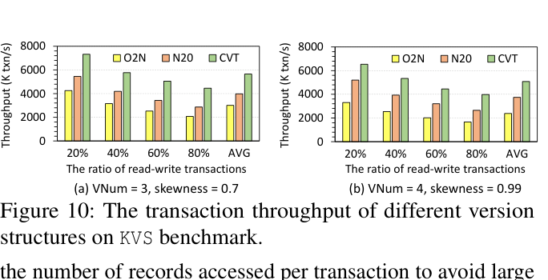

**图10：** 不同版本结构（CVT、O2N、N2O）在 KVS 基准上的事务吞吐量对比。术语说明：O2N（Old-to-new chain，旧到新链）、N2O（New-to-old chain，新到旧链）、CVT（连续版本元组）、Transaction throughput（事务吞吐量）、Skewness（访问倾斜度）

### 7.4 端到端性能

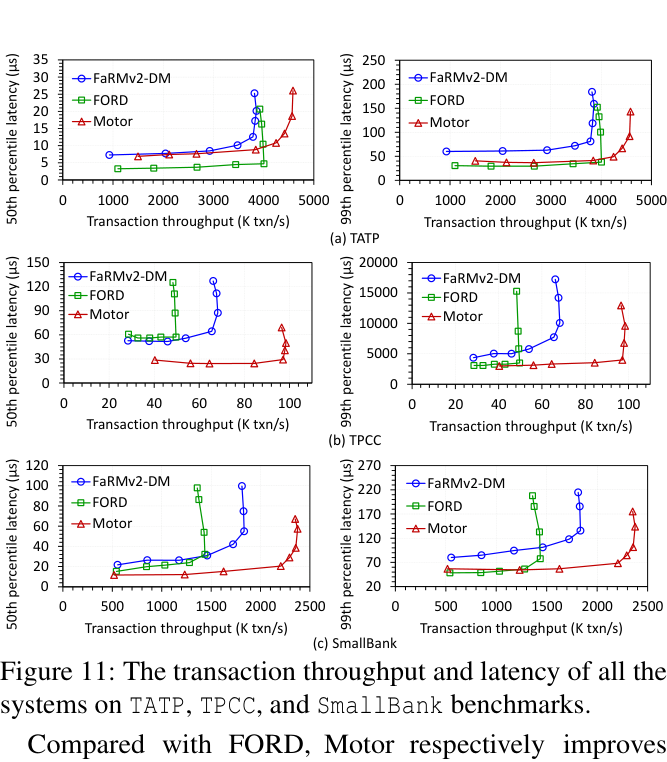

**图11：** Motor、FORD、FaRMv2-DM 在全部基准测试上的事务吞吐量与延迟对比。术语说明：Transaction throughput（事务吞吐量）、50th/99th percentile latency（第50/99百分位延迟）、FORD（单版本对比系统）、FaRMv2-DM（多版本对比系统，适配分离式内存）

**与 FORD 对比：** Motor 在 TATP、TPCC、SmallBank 上分别将吞吐量提升 14.4%、98.1%、65.4%，并在 TPCC/SmallBank 上将 50th 百分位延迟降低 55.8%/26.2%。Motor 通过允许读取 CVT 中的现有版本（无需等待写操作）并消除 undo 日志的网络写入来实现这些提升。在 TATP 中，由于 70% 的事务（GET_SUBSCRIBER_DATA 和 GET_ACCESS_DATA）只读取一个对象，FORD 仅需一次 RTT，而 Motor 需要两次 RTT 分别读取 CVT 和值，因此 FORD 的 50th 百分位延迟更低；但当事务较复杂时，Motor 的 99th 百分位延迟与 FORD 相近。

**与 FaRMv2-DM 对比：** Motor 在 TATP/TPCC/SmallBank 上分别将吞吐量提升 18.9%/44.3%/29.5%，并将 50th（99th）百分位延迟降低 8.6%（39.1%）/ 52.1%（35.6%）/ 43.6%（34.5%）。Motor 的三大优势：（1）CVT 一次往返即可获取所有版本，而 FaRMv2 的链式结构需要多次往返；（2）Motor 批量发送加锁与读取请求，而 FaRMv2 需要专用 RTT 加锁 RW 数据；（3）Motor 在一次 RTT 内提交所有副本，而 FaRMv2 需要两次 RTT 分别提交备副本和主副本。

### 7.5 内存开销

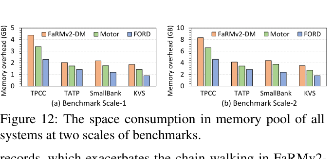

**图12：** 各系统在内存池中的空间占用对比。术语说明：Total memory used（总内存占用）、FORD（单版本系统）、FaRMv2-DM（链式多版本系统）、Motor（CVT 多版本系统）

FORD 仅存储一个版本，内存开销最低。Motor 和 FaRMv2-DM 因支持多版本而占用更多空间，但 Motor 通过三种方式节省内存：（1）存储实际修改的属性而非完整值；（2）精确估算属性条带大小；（3）为不同工作负载配置合适的 VNum。例如，Motor 支持 4 个版本的 TPCC 数据，但内存占用仅为 FORD 的 1.45 倍（而非 4 倍）。FaRMv2-DM 的内存开销比 Motor 高 14.6%–22.8%，因为 FaRMv2 为每个版本存储完整值，且需要指针链接旧版本。

### 7.6 不同内存占用下的性能

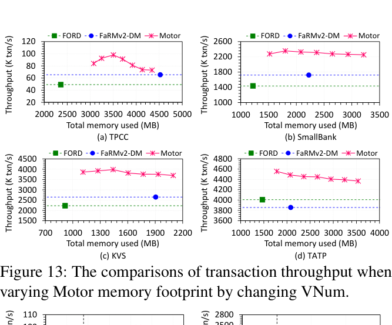

**图13：** 通过调整 VNum 改变内存占用时，各系统事务吞吐量的对比。术语说明：Transaction throughput（事务吞吐量）、Total memory used（总内存占用）、VNum（CVT 中版本数量）

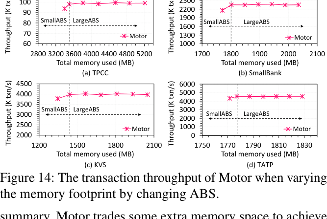

**图14：** 通过调整 ABS（属性条带大小）改变内存占用时，Motor 的事务吞吐量变化。术语说明：ABS（Attribute Bar Size，属性条带大小）、LargeABS（大属性条带）、SmallABS（小属性条带）、Throughput（吞吐量）

当减少 VNum 时，Motor 的内存占用最多降低 22.8%，接近 FORD，但吞吐量仍高于 FORD 和 FaRMv2-DM。当 VNum 从 2 增加到 8（增加 4 倍）时，Motor 内存占用仅增加约 1.4–2.1 倍，远低于线性增长，体现了属性存储的高效性。当 ABS 增大时吞吐量基本不变，证明了 Motor 估算 ABS 的高效性——所估算的大小恰好足够，无需浪费空间。

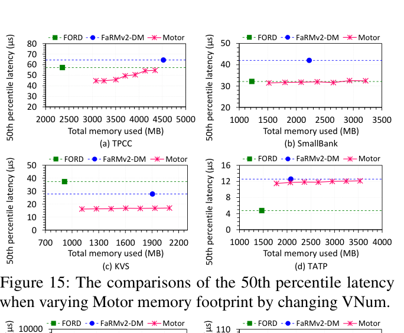

**图15：** 调整 VNum 改变内存占用时，第50百分位延迟的对比。术语说明：50th percentile latency（第50百分位延迟）、Total memory used（总内存占用）

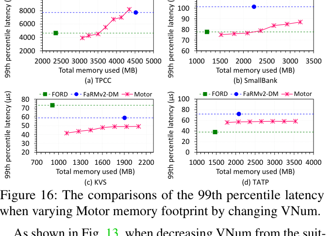

**图16：** 调整 VNum 改变内存占用时，第99百分位延迟的对比。术语说明：99th percentile latency（第99百分位延迟）、Total memory used（总内存占用）

### 7.7 不同隔离级别的性能

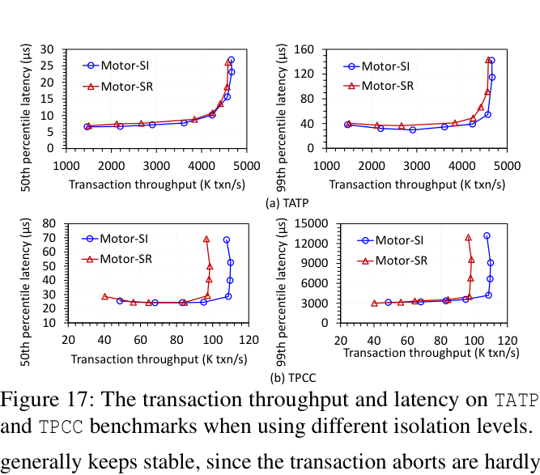

**图17：** Motor-SR（可串行化）与 Motor-SI（快照隔离）在 TATP 和 TPCC 基准上的事务吞吐量与延迟对比。术语说明：Motor-SR（Serializability，可串行化隔离级别）、Motor-SI（Snapshot Isolation，快照隔离级别）、Transaction throughput（事务吞吐量）、50th/99th percentile latency（第50/99百分位延迟）

Motor-SI（快照隔离）通过消除读写事务的验证阶段，在读密集型（TATP）和写密集型（TPCC）工作负载上均实现了比 Motor-SR（可串行化）更低的延迟和更高的吞吐量。在 TPCC 上，Motor-SI 的改善幅度高于 TATP，因为 TPCC 每个事务访问更多只读数据，且读写争用更高，放宽隔离要求带来了更大的性能提升。

### 7.8 内存池使用持久内存（PM）

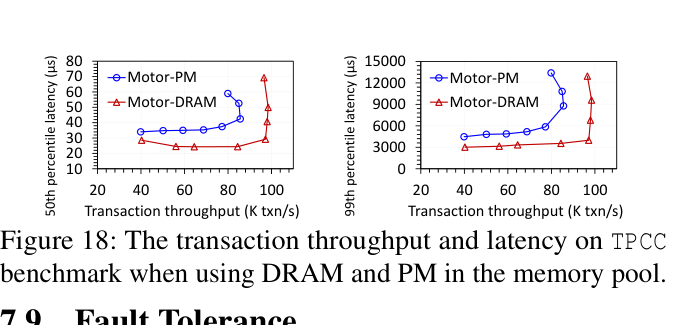

**图18：** 内存池使用 DRAM 和 PM（持久内存）时，Motor 在 TPCC 基准上的事务吞吐量与延迟对比。术语说明：Motor-DRAM（使用动态随机存取存储器）、Motor-PM（使用 Intel Optane 持久内存）、Transaction throughput（事务吞吐量）、50th/99th percentile latency（第50/99百分位延迟）

Motor 使用 6 块 128GB Intel Optane PM 模块评估 TPCC 性能（采用 RDMA READ-after-WRITE 确保远程数据持久化）。使用 PM 时，吞吐量仅降低 13.1%，证明 Motor 在 DRAM 和 PM 上均能高效工作，为不同类型内存设备上的应用提供了良好的可移植性。

### 7.9 容错性

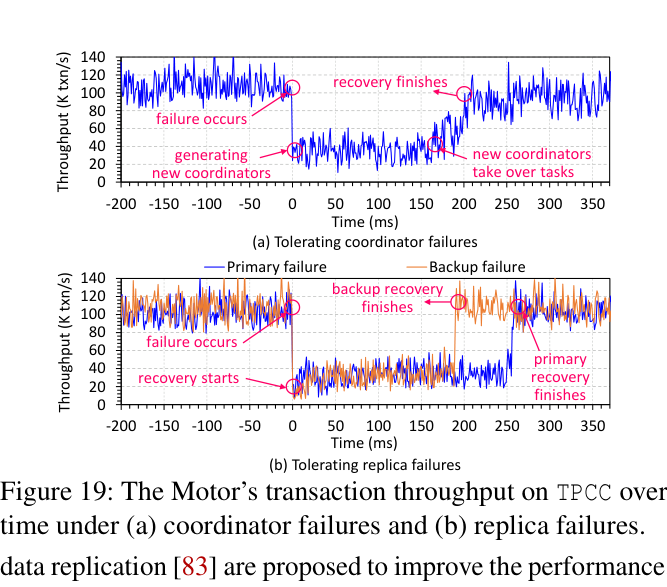

**图19：** TPCC 基准上 Motor 在协调者故障（a）和副本故障（b）下的事务吞吐量时间线。术语说明：(a) Tolerating coordinator failures（容忍协调者故障）、(b) Tolerating replica failures（容忍副本故障）、Throughput（吞吐量）、failure occurs（故障发生时刻）、recovery finishes（恢复完成时刻）、Primary failure（主副本故障）、Backup failure（备副本故障）

在 TPCC 基准上测试 Motor 在协调者故障和副本故障下的恢复能力（以 1ms 为间隔报告瞬时吞吐量）：

- **协调者故障恢复：** 60 个协调者同时故障时，Motor 约 170ms 后恢复至峰值吞吐量。新协调者利用旧协调者的操作日志（最大 556B/事务）恢复飞行中的提交并解锁 CVT，避免饥饿。
- **副本故障恢复：** 主副本故障恢复比备副本故障恢复耗时更长，因为 Motor 需要更改协调者的主副本视图，新主副本在更新提交到活跃副本前对协调者不可见。添加新备副本需要数据迁移，Motor 利用 RDMA WRITE 快速传输数据库表、CVT 和属性条带。对于较大的 CUSTOMER 表，迁移约需 200ms；对于较小的 DISTRICT 表，迁移仅需 1.1ms。

---

## 8. 相关工作

**快速分布式事务。** 许多系统利用 RDMA 处理分布式事务，部分研究将分布式事务转化为本地事务以降低通信开销，另有研究针对并发控制和数据复制提出改进方案。上述系统均面向单体架构，而 Motor 专注于分离式内存架构。

**内存分离。** 内存分离在硬件设计、操作系统、索引、键值存储、网络、纠删码、内存交换和内存管理等领域均有探索。Motor 专注于分离式内存上的事务处理，与上述研究正交。FORD 虽支持分离式内存上的事务，但采用单版本设计；Motor 通过多版本机制克服了 FORD 的局限。

**多版本方案。** 现有多版本研究集中于高性能 MVCC 协议、时间戳生成、垃圾回收和验证机制，均面向传统单体服务器，不适用于分离式内存。Motor 提出的 CVT 结构和分布式事务协议，专为分离式内存上的多版本处理设计。

---

## 9. 结论

本文提出 Motor，一个高效的分布式事务处理系统，在分离式内存场景下实现了多版本机制。Motor 提出新颖的连续版本元组（CVT）结构，在内存池中高效组织数据的多个版本；在 CVT 之上，Motor 设计了完全面向单侧 RDMA 的 MVCC 协议，加速事务处理。大量实验结果表明，Motor 在适度内存开销下显著提升了事务吞吐量并降低了延迟。

**致谢：** 本工作部分受国家自然科学基金（NSFC）资助，项目编号 62125202 和 U22B2022。感谢匿名评审人提出的建设性意见和反馈。

---

## 参考文献

[1] Telecom application transaction processing benchmark. http://tatpbenchmark.sourceforge.net, 2011.

[2] Intel® rack scale design architecture. https://www.intel.com/content/dam/www/public/us/en/documents/white-papers/rack-scale-design-architecture-white-paper.pdf, 2018.

[3] Vmware Research: Remote memory. https://research.vmware.com/projects/remote-memory, 2021.

[4] Smallbank benchmark. https://hstore.cs.brown.edu/documentation/deployment/benchmarks/smallbank, 2022.

[5] Precedence graph. https://en.wikipedia.org/wiki/Precedence_graph, 2023.

[6] Rdma aware networks programming user manual v1.7. https://docs.nvidia.com/networking/display/rdmaawareprogrammingv17/transport+modes, 2023.

[7] Compute express link®. https://www.computeexpresslink.org, 2024.

[8] Intel® Data Direct I/O Technology. https://www.intel.com/content/www/us/en/io/data-direct-i-o-technology.html, 2024.

[9] MySQL: The world's most popular open source database. https://www.mysql.com, 2024.

[10] PostgreSQL: The World's Most Advanced Open Source Relational Database. https://www.postgresql.org, 2024.

[11] Serializability. https://en.wikipedia.org/wiki/Database_transaction_schedule#Serializable, 2024.

[12] Snapshot isolation. https://en.wikipedia.org/wiki/Snapshot_isolation, 2024.

[13] Tpc-c benchmark. http://www.tpc.org/tpcc, 2024.

[14] Marcos K. Aguilera, Nadav Amit, Irina Calciu, Xavier Deguillard, Jayneel Gandhi, Stanko Novakovic, Arun Ramanathan, Pratap Subrahmanyam, Lalith Suresh, Kiran Tati, Rajesh Venkatasubramanian, and Michael Wei. Remote regions: a simple abstraction for remote memory. In *2018 USENIX Annual Technical Conference, USENIX ATC 2018, Boston, MA, USA, July 11-13, 2018*, pages 775–787. USENIX Association, 2018.

[15] Emmanuel Amaro, Christopher Branner-Augmon, Zhihong Luo, Amy Ousterhout, Marcos K. Aguilera, Aurojit Panda, Sylvia Ratnasamy, and Scott Shenker. Can far memory improve job throughput? In *EuroSys '20: Fifteenth EuroSys Conference 2020, Heraklion, Greece, April 27-30, 2020*, pages 14:1–14:16. ACM, 2020.

[16] Jan Böttcher, Viktor Leis, Thomas Neumann, and Alfons Kemper. Scalable garbage collection for in-memory MVCC systems. *Proc. VLDB Endow.*, 13(2):128–141, 2019.

[17] Eric Brewer. Cap twelve years later: How the "rules" have changed. *Computer*, 45(2):23–29, 2012.

[18] Eric A Brewer. Towards robust distributed systems. In *PODC*, volume 7, pages 343477–343502. Portland, OR, 2000.

[19] Qingchao Cai, Wentian Guo, Hao Zhang, Divyakant Agrawal, Gang Chen, Beng Chin Ooi, Kian-Lee Tan, Yong Meng Teo, and Sheng Wang. Efficient distributed memory management with RDMA and caching. *Proc. VLDB Endow.*, 11(11):1604–1617, 2018.

[20] Irina Calciu, M. Talha Imran, Ivan Puddu, Sanidhya Kashyap, Hasan Al Maruf, Onur Mutlu, and Aasheesh Kolli. Rethinking software runtimes for disaggregated memory. In *ASPLOS '21: 26th ACM International Conference on Architectural Support for Programming Languages and Operating Systems, Virtual Event, USA, April 19-23, 2021*, pages 79–92. ACM, 2021.

[21] Yun-Sheng Chang, Ralf Jung, Upamanyu Sharma, Joseph Tassarotti, M. Frans Kaashoek, and Nickolai Zeldovich. Verifying vmvcc, a high-performance transaction library using multi-version concurrency control. In *17th USENIX Symposium on Operating Systems Design and Implementation, OSDI 2023, Boston, MA, USA, July 10-12, 2023*, pages 871–886. USENIX Association, 2023.

[22] Yanzhe Chen, Xingda Wei, Jiaxin Shi, Rong Chen, and Haibo Chen. Fast and general distributed transactions using RDMA and HTM. In *Proceedings of the Eleventh European Conference on Computer Systems, EuroSys 2016, London, United Kingdom, April 18-21, 2016*, pages 26:1–26:17. ACM, 2016.

[23] Brian F. Cooper, Adam Silberstein, Erwin Tam, Raghu Ramakrishnan, and Russell Sears. Benchmarking cloud serving systems with YCSB. In *Proceedings of the 1st ACM Symposium on Cloud Computing, SoCC 2010, Indianapolis, Indiana, USA, June 10-11, 2010*, pages 143–154. ACM, 2010.

[24] James C. Corbett, Jeffrey Dean, Michael Epstein, Andrew Fikes, Christopher Frost, J. J. Furman, Sanjay Ghemawat, Andrey Gubarev, Christopher Heiser, Peter Hochschild, Wilson C. Hsieh, Sebastian Kanthak, Eugene Kogan, Hongyi Li, Alexander Lloyd, Sergey Melnik, David Mwaura, David Nagle, Sean Quinlan, Rajesh Rao, Lindsay Rolig, Yasushi Saito, Michal Szymaniak, Christopher Taylor, Ruth Wang, and Dale Woodford. Spanner: Google's globally-distributed database. In *10th USENIX Symposium on Operating Systems Design and Implementation, OSDI 2012, Hollywood, CA, USA, October 8-10, 2012*, pages 251–264. USENIX Association, 2012.

[25] Cristian Diaconu, Craig Freedman, Erik Ismert, Per-Åke Larson, Pravin Mittal, Ryan Stonecipher, Nitin Verma, and Mike Zwilling. Hekaton: SQL server's memory-optimized OLTP engine. In *Proceedings of the ACM SIGMOD International Conference on Management of Data, SIGMOD 2013, New York, NY, USA, June 22-27, 2013*, pages 1243–1254. ACM, 2013.

[26] Aleksandar Dragojevic, Dushyanth Narayanan, Miguel Castro, and Orion Hodson. Farm: Fast remote memory. In *Proceedings of the 11th USENIX Symposium on Networked Systems Design and Implementation, NSDI 2014, Seattle, WA, USA, April 2-4, 2014*, pages 401–414. USENIX Association, 2014.

[27] Aleksandar Dragojevic, Dushyanth Narayanan, Edmund B. Nightingale, Matthew Renzelmann, Alex Shamis, Anirudh Badam, and Miguel Castro. No compromises: distributed transactions with consistency, availability, and performance. In *Proceedings of the 25th Symposium on Operating Systems Principles, SOSP 2015, Monterey, CA, USA, October 4-7, 2015*, pages 54–70. ACM, 2015.

[28] Tamer Eldeeb, Xincheng Xie, Philip A. Bernstein, Asaf Cidon, and Junfeng Yang. Chardonnay: Fast and general datacenter transactions for on-disk databases. In *17th USENIX Symposium on Operating Systems Design and Implementation, OSDI 2023, Boston, MA, USA, July 10-12, 2023*, pages 343–360. USENIX Association, 2023.

[29] Peter Xiang Gao, Akshay Narayan, Sagar Karandikar, Joao Carreira, Sangjin Han, Rachit Agarwal, Sylvia Ratnasamy, and Scott Shenker. Network requirements for resource disaggregation. In *12th USENIX Symposium on Operating Systems Design and Implementation, OSDI 2016, Savannah, GA, USA, November 2-4, 2016*, pages 249–264. USENIX Association, 2016.

[30] Seth Gilbert and Nancy Lynch. Brewer's conjecture and the feasibility of consistent, available, partition-tolerant web services. *Acm Sigact News*, 33(2):51–59, 2002.

[31] Cary Gray and David Cheriton. Leases: An efficient fault-tolerant mechanism for distributed file cache consistency. *ACM SIGOPS Operating Systems Review*, 23(5):202–210, 1989.

[32] Martin Grund, Jens Krüger, Hasso Plattner, Alexander Zeier, Philippe Cudré-Mauroux, and Samuel Madden. HYRISE - A main memory hybrid storage engine. *Proc. VLDB Endow.*, 4(2):105–116, 2010.

[33] Juncheng Gu, Youngmoon Lee, Yiwen Zhang, Mosharaf Chowdhury, and Kang G. Shin. Efficient memory disaggregation with infiniswap. In *14th USENIX Symposium on Networked Systems Design and Implementation, NSDI 2017, Boston, MA, USA, March 27-29, 2017*, pages 649–667. USENIX Association, 2017.

[34] Rachid Guerraoui, Antoine Murat, Javier Picorel, Athanasios Xygkis, Huabing Yan, and Pengfei Zuo. ukharon: A membership service for microsecond applications. In *2022 USENIX Annual Technical Conference, USENIX ATC 2022, Carlsbad, CA, USA, July 11-13, 2022*, pages 101–120. USENIX Association, 2022.

[35] Zhiyuan Guo, Yizhou Shan, Xuhao Luo, Yutong Huang, and Yiying Zhang. Clio: a hardware-software co-designed disaggregated memory system. In *ASPLOS '22: 27th ACM International Conference on Architectural Support for Programming Languages and Operating Systems, Lausanne, Switzerland, 28 February 2022 - 4 March 2022*, pages 417–433. ACM, 2022.

[36] Doug Hakkarinen, Panruo Wu, and Zizhong Chen. Fail-stop failure algorithm-based fault tolerance for cholesky decomposition. *IEEE Transactions on Parallel and Distributed Systems*, 26(5):1323–1335, 2015.

[37] Chi Ho, Robbert van Renesse, Mark Bickford, and Danny Dolev. Nysiad: Practical protocol transformation to tolerate byzantine failures. In *5th USENIX Symposium on Networked Systems Design & Implementation, NSDI 2008, April 16-18, 2008, San Francisco, CA, USA, Proceedings*, pages 175–188. USENIX Association, 2008.

[38] Tianyang Jiang, Guangyan Zhang, Zhiyue Li, and Weimin Zheng. Aurogon: Taming aborts in all phases for distributed In-Memory transactions. In *20th USENIX Conference on File and Storage Technologies (FAST 22)*, pages 217–232, Santa Clara, CA, February 2022. USENIX Association.

[39] Anuj Kalia, Michael Kaminsky, and David G. Andersen. Fasst: Fast, scalable and simple distributed transactions with two-sided (RDMA) datagram rpcs. In *12th USENIX Symposium on Operating Systems Design and Implementation, OSDI 2016, Savannah, GA, USA, November 2-4, 2016*, pages 185–201. USENIX Association, 2016.

[40] Antonios Katsarakis, Yijun Ma, Zhaowei Tan, Andrew Bainbridge, Matthew Balkwill, Aleksandar Dragojevic, Boris Grot, Bozidar Radunovic, and Yongguang Zhang. Zeus: locality-aware distributed transactions. In *EuroSys '21: Sixteenth European Conference on Computer Systems, Online Event, United Kingdom, April 26-28, 2021*, pages 145–161. ACM, 2021.

[41] Daehyeok Kim, Amirsaman Memaripour, Anirudh Badam, Yibo Zhu, Hongqiang Harry Liu, Jitu Padhye, Shachar Raindel, Steven Swanson, Vyas Sekar, and Srinivasan Seshan. Hyperloop: group-based nic-offloading to accelerate replicated transactions in multi-tenant storage systems. In *Proceedings of the 2018 Conference of the ACM Special Interest Group on Data Communication, SIGCOMM 2018, Budapest, Hungary, August 20-25, 2018*, pages 297–312. ACM, 2018.

[42] Leslie Lamport, Dahlia Malkhi, and Lidong Zhou. Vertical paxos and primary-backup replication. In *Proceedings of the 28th Annual ACM Symposium on Principles of Distributed Computing, PODC 2009, Calgary, Alberta, Canada, August 10-12, 2009*, pages 312–313. ACM, 2009.

[43] Per-Åke Larson, Spyros Blanas, Cristian Diaconu, Craig Freedman, Jignesh M. Patel, and Mike Zwilling. High-performance concurrency control mechanisms for main-memory databases. *Proc. VLDB Endow.*, 5(4):298–309, 2011.

[44] Juchang Lee, Hyungyu Shin, Chang Gyoo Park, Seongyun Ko, Jaeyun Noh, Yongjae Chuh, Wolfgang Stephan, and Wook-Shin Han. Hybrid garbage collection for multi-version concurrency control in SAP HANA. In *Proceedings of the 2016 International Conference on Management of Data, SIGMOD Conference 2016, San Francisco, CA, USA, June 26 - July 01, 2016*, pages 1307–1318. ACM, 2016.

[45] Se Kwon Lee, Soujanya Ponnapalli, Sharad Singhal, Marcos K. Aguilera, Kimberly Keeton, and Vijay Chidambaram. DINOMO: an elastic, scalable, high-performance key-value store for disaggregated persistent memory. *Proc. VLDB Endow.*, 15(13):4023–4037, 2022.

[46] Seung-seob Lee, Yanpeng Yu, Yupeng Tang, Anurag Khandelwal, Lin Zhong, and Abhishek Bhattacharjee. MIND: in-network memory management for disaggregated data centers. In *SOSP '21: ACM SIGOPS 28th Symposium on Operating Systems Principles, Virtual Event / Koblenz, Germany, October 26-29, 2021*, pages 488–504. ACM, 2021.

[47] Youngmoon Lee, Hasan Al Maruf, Mosharaf Chowdhury, Asaf Cidon, and Kang G. Shin. Hydra: Resilient and highly available remote memory. In *20th USENIX Conference on File and Storage Technologies, FAST 2022, Santa Clara, CA, USA, February 22-24, 2022*, pages 181–198. USENIX Association, 2022.

[48] Huaicheng Li, Daniel S. Berger, Lisa Hsu, Daniel Ernst, Pantea Zardoshti, Stanko Novakovic, Monish Shah, Samir Rajadnya, Scott Lee, Ishwar Agarwal, Mark D. Hill, Marcus Fontoura, and Ricardo Bianchini. Pond: Cxl-based memory pooling systems for cloud platforms. In *Proceedings of the 28th ACM International Conference on Architectural Support for Programming Languages and Operating Systems, Volume 2, ASPLOS 2023, Vancouver, BC, Canada, March 25-29, 2023*, pages 574–587. ACM, 2023.

[49] Pengfei Li, Yu Hua, Pengfei Zuo, Zhangyu Chen, and Jiajie Sheng. ROLEX: A scalable rdma-oriented learned key-value store for disaggregated memory systems. In *21st USENIX Conference on File and Storage Technologies, FAST 2023, Santa Clara, CA, USA, February 21-23, 2023*, pages 99–114. USENIX Association, 2023.

[50] Kevin T. Lim, Jichuan Chang, Trevor N. Mudge, Parthasarathy Ranganathan, Steven K. Reinhardt, and Thomas F. Wenisch. Disaggregated memory for expansion and sharing in blade servers. In *36th International Symposium on Computer Architecture (ISCA 2009), June 20-24, 2009, Austin, TX, USA*, pages 267–278. ACM, 2009.

[51] Kevin T. Lim, Yoshio Turner, Jose Renato Santos, Alvin AuYoung, Jichuan Chang, Parthasarathy Ranganathan, and Thomas F. Wenisch. System-level implications of disaggregated memory. In *18th IEEE International Symposium on High Performance Computer Architecture, HPCA 2012, New Orleans, LA, USA, 25-29 February, 2012*, pages 189–200. IEEE Computer Society, 2012.

[52] Qian Lin, Pengfei Chang, Gang Chen, Beng Chin Ooi, Kian-Lee Tan, and Zhengkui Wang. Towards a non-2pc transaction management in distributed database systems. In *Proceedings of the 2016 International Conference on Management of Data, SIGMOD Conference 2016, San Francisco, CA, USA, June 26 - July 01, 2016*, pages 1659–1674. ACM, 2016.

[53] Xuchuan Luo, Pengfei Zuo, Jiacheng Shen, Jiazhen Gu, Xin Wang, Michael R. Lyu, and Yangfan Zhou. SMART: A high-performance adaptive radix tree for disaggregated memory. In *17th USENIX Symposium on Operating Systems Design and Implementation, OSDI 2023, Boston, MA, USA, July 10-12, 2023*, pages 553–566. USENIX Association, 2023.

[54] Teng Ma, Mingxing Zhang, Kang Chen, Zhuo Song, Yongwei Wu, and Xuehai Qian. Asymnvm: An efficient framework for implementing persistent data structures on asymmetric NVM architecture. In *ASPLOS '20: Architectural Support for Programming Languages and Operating Systems, Lausanne, Switzerland, March 16-20, 2020*, pages 757–773. ACM, 2020.

[55] Shuai Mu, Yang Cui, Yang Zhang, Wyatt Lloyd, and Jinyang Li. Extracting more concurrency from distributed transactions. In *11th USENIX Symposium on Operating Systems Design and Implementation, OSDI '14, Broomfield, CO, USA, October 6-8, 2014*, pages 479–494. USENIX Association, 2014.

[56] MySQL. Transaction isolation levels. https://dev.mysql.com/doc/refman/8.0/en/innodb-transaction-isolation-levels.html, 2024.

[57] Thomas Neumann, Tobias Mühlbauer, and Alfons Kemper. Fast serializable multi-version concurrency control for main-memory database systems. In *Proceedings of the 2015 ACM SIGMOD International Conference on Management of Data, Melbourne, Victoria, Australia, May 31 - June 4, 2015*, pages 677–689. ACM, 2015.

[58] Stanko Novakovic, Yizhou Shan, Aasheesh Kolli, Michael Cui, Yiying Zhang, Haggai Eran, Boris Pismenny, Liran Liss, Michael Wei, Dan Tsafrir, and Marcos K. Aguilera. Storm: a fast transactional dataplane for remote data structures. In *Proceedings of the 12th ACM International Conference on Systems and Storage, SYSTOR 2019, Haifa, Israel, June 3-5, 2019*, pages 97–108. ACM, 2019.

[59] Oracle. Transaction isolation levels. https://www.oreilly.com/library/view/java-programming-with/0596000871/0596000871_orasqlj-CHP-9-SECT-2.html, 2024.

[60] PostgreSQL. Transaction isolation. https://www.postgresql.org/docs/current/transaction-iso.html, 2024.

[61] Waleed Reda, Marco Canini, Dejan Kostic, and Simon Peter. RDMA is turing complete, we just did not know it yet! In *19th USENIX Symposium on Networked Systems Design and Implementation, NSDI 2022, Renton, WA, USA, April 4-6, 2022*, pages 71–85. USENIX Association, 2022.

[62] Zhenyuan Ruan, Malte Schwarzkopf, Marcos K. Aguilera, and Adam Belay. AIFM: high-performance, application-integrated far memory. In *14th USENIX Symposium on Operating Systems Design and Implementation, OSDI 2020, Virtual Event, November 4-6, 2020*, pages 315–332. USENIX Association, 2020.

[63] SQL Server. Set transaction isolation level. https://learn.microsoft.com/en-us/sql/t-sql/statements/set-transaction-isolation-level-transact-sql?view=sql-server-ver16, 2023.

[64] Alex Shamis, Matthew Renzelmann, Stanko Novakovic, Georgios Chatzopoulos, Aleksandar Dragojevic, Dushyanth Narayanan, and Miguel Castro. Fast general distributed transactions with opacity. In *Proceedings of the 2019 International Conference on Management of Data, SIGMOD Conference 2019, Amsterdam, The Netherlands, June 30 - July 5, 2019*, pages 433–448. ACM, 2019.

[65] Yizhou Shan, Yutong Huang, Yilun Chen, and Yiying Zhang. Legoos: A disseminated, distributed OS for hardware resource disaggregation. In *13th USENIX Symposium on Operating Systems Design and Implementation, OSDI 2018, Carlsbad, CA, USA, October 8-10, 2018*, pages 69–87. USENIX Association, 2018.

[66] Jiacheng Shen, Pengfei Zuo, Xuchuan Luo, Tianyi Yang, Yuxin Su, Yangfan Zhou, and Michael R. Lyu. FUSEE: A fully memory-disaggregated key-value store. In *21st USENIX Conference on File and Storage Technologies, FAST 2023, Santa Clara, CA, USA, February 21-23, 2023*, pages 81–98. USENIX Association, 2023.

[67] Vishal Shrivastav, Asaf Valadarsky, Hitesh Ballani, Paolo Costa, Ki-Suh Lee, Han Wang, Rachit Agarwal, and Hakim Weatherspoon. Shoal: A network architecture for disaggregated racks. In *16th USENIX Symposium on Networked Systems Design and Implementation, NSDI 2019, Boston, MA, February 26-28, 2019*, pages 255–270. USENIX Association, 2019.

[68] Abraham Silberschatz, Henry F. Korth, and S. Sudarshan. *Database System Concepts, 7th Edition*. McGraw-Hill Education, 2019.

[69] Shin-Yeh Tsai, Yizhou Shan, and Yiying Zhang. Disaggregating persistent memory and controlling them remotely: An exploration of passive disaggregated key-value stores. In *2020 USENIX Annual Technical Conference, USENIX ATC 2020, July 15-17, 2020*, pages 33–48. USENIX Association, 2020.

[70] Shin-Yeh Tsai and Yiying Zhang. LITE kernel RDMA support for datacenter applications. In *Proceedings of the 26th Symposium on Operating Systems Principles, Shanghai, China, October 28-31, 2017*, pages 306–324. ACM, 2017.

[71] Stephen Tu, Wenting Zheng, Eddie Kohler, Barbara Liskov, and Samuel Madden. Speedy transactions in multicore in-memory databases. In *ACM SIGOPS 24th Symposium on Operating Systems Principles, SOSP '13, Farmington, PA, USA, November 3-6, 2013*, pages 18–32. ACM, 2013.

[72] Chenxi Wang, Haoran Ma, Shi Liu, Yuanqi Li, Zhenyuan Ruan, Khanh Nguyen, Michael D. Bond, Ravi Netravali, Miryung Kim, and Guoqing Harry Xu. Semeru: A memory-disaggregated managed runtime. In *14th USENIX Symposium on Operating Systems Design and Implementation (OSDI 20)*, pages 261–280. USENIX Association, November 2020.

[73] Chenxi Wang, Haoran Ma, Shi Liu, Yifan Qiao, Jonathan Eyolfson, Christian Navasca, Shan Lu, and Guoqing Harry Xu. Memliner: Lining up tracing and application for a far-memory-friendly runtime. In *16th USENIX Symposium on Operating Systems Design and Implementation, OSDI 2022, Carlsbad, CA, USA, July 11-13, 2022*, pages 35–53. USENIX Association, 2022.

[74] Jia-Chen Wang, Ding Ding, Huan Wang, Conrad Christensen, Zhaoguo Wang, Haibo Chen, and Jinyang Li. Polyjuice: High-performance transactions via learned concurrency control. In *15th USENIX Symposium on Operating Systems Design and Implementation, OSDI 2021, July 14-16, 2021*, pages 198–216. USENIX Association, 2021.

[75] Qing Wang, Youyou Lu, and Jiwu Shu. Sherman: A write-optimized distributed b+ tree index on disaggregated memory. In *Proceedings of the 2022 International Conference on Management of Data*, pages 1033–1048, 2022.

[76] Xingda Wei, Rong Chen, Haibo Chen, Zhaoguo Wang, Zhenhan Gong, and Binyu Zang. Unifying timestamp with transaction ordering for MVCC with decentralized scalar timestamp. In *18th USENIX Symposium on Networked Systems Design and Implementation, NSDI 2021, April 12-14, 2021*, pages 357–372. USENIX Association, 2021.

[77] Xingda Wei, Zhiyuan Dong, Rong Chen, and Haibo Chen. Deconstructing rdma-enabled distributed transactions: Hybrid is better! In *13th USENIX Symposium on Operating Systems Design and Implementation, OSDI 2018, Carlsbad, CA, USA, October 8-10, 2018*, pages 233–251. USENIX Association, 2018.

[78] Xingda Wei, Jiaxin Shi, Yanzhe Chen, Rong Chen, and Haibo Chen. Fast in-memory transaction processing using RDMA and HTM. In *Proceedings of the 25th Symposium on Operating Systems Principles, SOSP 2015, Monterey, CA, USA, October 4-7, 2015*, pages 87–104. ACM, 2015.

[79] Chao Xie, Chunzhi Su, Cody Littley, Lorenzo Alvisi, Manos Kapritsos, and Yang Wang. High-performance ACID via modular concurrency control. In *Proceedings of the 25th Symposium on Operating Systems Principles, SOSP 2015, Monterey, CA, USA, October 4-7, 2015*, pages 279–294. ACM, 2015.

[80] Jian Yang, Juno Kim, Morteza Hoseinzadeh, Joseph Izraelevitz, and Steven Swanson. An empirical guide to the behavior and use of scalable persistent memory. In *18th USENIX Conference on File and Storage Technologies, FAST 2020, Santa Clara, CA, USA, February 24-27, 2020*, pages 169–182. USENIX Association, 2020.

[81] Erfan Zamanian, Carsten Binnig, Tim Harris, and Tim Kraska. The end of a myth: Distributed transactions can scale. *Proc. VLDB Endow.*, 10(6):685–696, February 2017.

[82] Erfan Zamanian, Julian Shun, Carsten Binnig, and Tim Kraska. Chiller: Contention-centric transaction execution and data partitioning for modern networks. In *Proceedings of the 2020 International Conference on Management of Data, SIGMOD Conference 2020, online conference [Portland, OR, USA], June 14-19, 2020*, pages 511–526. ACM, 2020.

[83] Irene Zhang, Naveen Kr. Sharma, Adriana Szekeres, Arvind Krishnamurthy, and Dan R. K. Ports. Building consistent transactions with inconsistent replication. In *Proceedings of the 25th Symposium on Operating Systems Principles, SOSP 2015, Monterey, CA, USA, October 4-7, 2015*, pages 263–278. ACM, 2015.

[84] Ming Zhang, Yu Hua, Pengfei Zuo, and Lurong Liu. FORD: Fast One-sided RDMA-based Distributed Transactions for Disaggregated Persistent Memory. In *20th USENIX Conference on File and Storage Technologies, FAST 2022, Santa Clara, CA, USA, February 22-24, 2022*, pages 51–68. USENIX Association, 2022.

[85] Yang Zhou, Hassan M. G. Wassel, Sihang Liu, Jiaqi Gao, James Mickens, Minlan Yu, Chris Kennelly, Paul Turner, David E. Culler, Henry M. Levy, and Amin Vahdat. Carbink: Fault-tolerant far memory. In *16th USENIX Symposium on Operating Systems Design and Implementation, OSDI 2022, Carlsbad, CA, USA, July 11-13, 2022*, pages 55–71. USENIX Association, 2022.

[86] Pengfei Zuo, Jiazhao Sun, Liu Yang, Shuangwu Zhang, and Yu Hua. One-sided rdma-conscious extendible hashing for disaggregated memory. In *2021 USENIX Annual Technical Conference, USENIX ATC 2021, July 14-16, 2021*, pages 15–29. USENIX Association, 2021.

---

*源码：https://github.com/minghust/motor*
